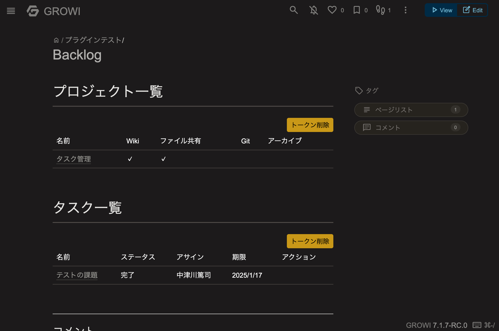

# GROIW Plugin for Backlog

This is GROWI plugin for [Backlog](https://backlog.com/).

## Usage

### Get API Key

You have to get API key from Backlog in personal setting.


### Write markdown in GROWI

#### Get projects

```markdown
::backlog[projects]{host=example.backlog.com}
```

At first, you should input your backlog API key. It is stored in your browser local storage.


After that, you can get projects like below.



##### Options

You can specify options like below.

- archived: boolean
- all: boolean

This is example.

```markdown
::backlog[projects]{host=example.backlog.com archived=true}
```

### List issues

```markdown
::backlog[issues]{host=example.backlog.com}
```


##### Options

You can specify options from [Get Issue List \| Backlog Developer API \| Nulab](https://developer.nulab.com/docs/backlog/api/2/get-issue-list/).

This is example.

```markdown
::backlog[issues]{host=example.backlog.com sort=category}
```

### Change Issue status

You can change issue status.

- Open -> In Progress
- In Progress -> Done
- Done -> Finished


## License

MIT

